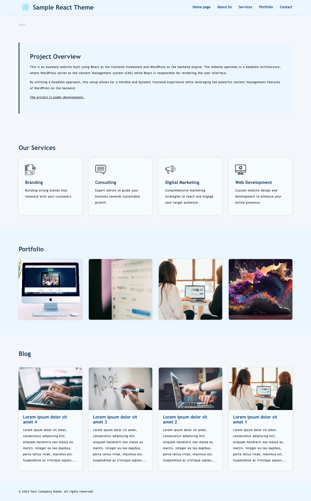

# Headless WordPress React Theme

This project is a headless WordPress theme built with React as the frontend, allowing for a decoupled architecture. It fetches data from a WordPress backend using the REST API, providing a dynamic and responsive user experience.

## Features

- **Decoupled Architecture**: Utilizes WordPress as a headless CMS, separating the backend from the frontend.
- **Dynamic Content**: Fetches blog posts, services, and portfolio items using the WordPress REST API.
- **Responsive Design**: Built with modern CSS techniques (Sass) to ensure a seamless experience on all devices.
- **Easy to Customize**: Designed to be easily extendable and customizable.

## Active Development

The project is currently under active development, with ongoing enhancements and new features being added regularly.

## Screenshot

